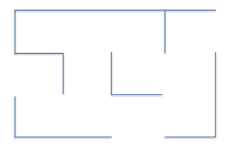

# Optimizing the Flows in an E-Commerce Warehouse with Reinforcement Learning

## Problem to solve
The problem to solve will be to optimize the flows inside the following warehouse:

The warehouse belongs to an online retail company that sells products to a variety of customers. Inside this
warehouse, the products are stored in 12 different locations, labeled by the following letters from A to L:

As the orders are placed by the customers online, an Autonomous Warehouse Robot is moving around the
warehouse to collect the products for future deliveries. Here is what it looks like:

The 12 locations are all connected to a computer system, which is ranking in real time the priorities of
product collection for these 12 locations. For example, at a specific time t, it will return the following
ranking:

| **Priority Rank** | **Location** |
|:-----------------:|:------------:|
| 1                 | G            |
| 2                 | K            |
| 3                 | L            |
| 4                 | J            |
| 5                 | A            |
| 6                 | I            |
| 7                 | H            |
| 8                 | C            |
| 9                 | B            |
| 10                | D            |
| 11                | F            |
| 12                | E            |

Location G has priority 1, which means it is the top priority, as it contains a product that must be collected
and delivered immediately. Our Autonomous Warehouse Robot must move to location G by the shortest
route depending on where it is. Our goal is to build an AI that will return that shortest route, wherever the
robot is. But then as we see, locations K and L are in the Top 3 priorities. Hence we will want to implement
an option for our Autonomous Warehouse Robot to go by some intermediary locations before reaching its
final top priority location.

The way the system computes the priorities of the locations is out of the scope of this case study. The reason
for this is that there can be many ways, from simple rules or algorithms, to deterministic computations, to
machine learning. But most of these ways would not be artificial intelligence as we know it today. What
we really want to focus on is core AI, encompassing Q-Learning, Deep Q-Learning and other branches of
Reinforcement Learning. So we will just say for example that Location G is top priority because one of the
most loyal platinum customers of the company placed an urgent order of a product stored in location G
which therefore must be delivered as soon as possible.

Therefore in conclusion, our mission is to build an AI that will always take the shortest route to the top
priority location, whatever the location it starts from, and having the option to go by an intermediary
location which is in the top 3 priorities.

To see the solution [here](https://github.com/hagijakobson/optimizing-warehouse-flows/blob/main/q-learning.py).
